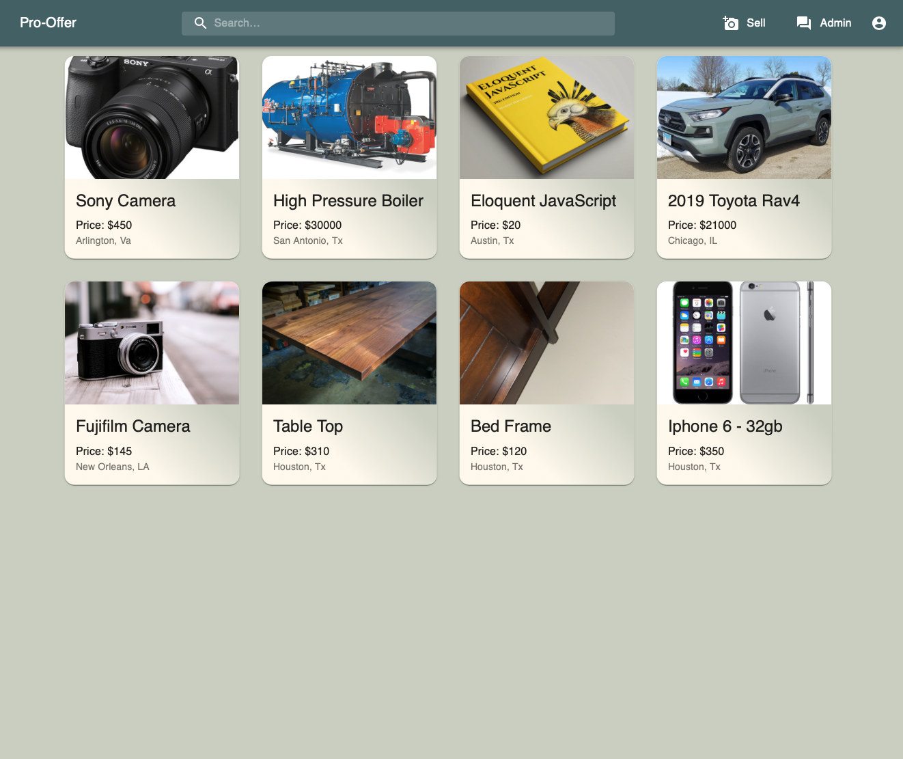

<h1 align="center"> PRO-OFFER </h1> 

 

  

  
### Description
This full stack web application will help the user to publish products to sell. On the other hand, users are able make offers to buy any item in the system. To establish a conversation between user and seller, a live chat button is available in the product detail page. Also, an administrator chat is in the menu to test the real-life chat. 

### Table of Contents

  * [Installation](#installation)
  * [Usage](#usage)
  * [License](#license)
  * [Credits](#credits)
  * [Contributing](#contributing)
  * [Questions](#questions)

### Installation
This app is completely deployed using Heroku: [Deployed Link](https://pro-offer.herokuapp.com)

### Usage

Demo:

### License

Copyright (c) Andres Acosta. All rights reserved.
Licensed under the [MIT license](LICENSE).

### Credits

👤 **Andres Acosta** (author): [GitHub](https://github.com/acosta-andres-r)

### Contributing
Please note that this project is released with a [Contributor Code of Conduct](CODE_OF_CONDUCT.md). By participating in this project you agree to abide by its terms.

### Questions
 For more information, additional questions or comments, please contact [Andres Acosta](https://github.com/acosta-andres-r).

